# Introduction
During this past summer, I interned at a wealth management boutique, and during my time there, I came across a very annoying repeated task. A lot of the work that ended up being done felt mechanical, a bunch of repeated tasks and pathways that felt like they could be streamlined, and so I spent time brainstorming a way to make these efforts more efficient. The biggest problem was how tedious it was to sort through a client file, aggregate each claim, sort them out neatly, and compare them to public thresholds. The thing with this isn't that it's hard, but moreso that it's easy to make mistakes in and annoying to repeatedly do. 

Say someone gives a cash gift to 3 people, before you would have to open a spreadsheet, note each one down, look up the gift limit in regards to tax codes for the current year, and figure out if a form is needed to be filled out. It does the same for foreign accounts, charity donations, income, trust income, and pulls from 45 **government sources** in regards to tax codes, baselines for comparison, and more. Now, plugging in files to this (locally run, private, open-source software) allows for much more exact calculations, groupings, and triggers of forms. It doesn't make a decision for you, it helps put everything in a simple UI that you can see, which not only saves time but also might make fewer mistakes. This serves as a **supporting** piece of software meant to make lives easier, but not figure everything out on its own.

Version 1 served as a way to showcase a deeper understanding of tax codes, a prototype of what streamlined actually meant with 3 fictional cases, and as a demo to what a fuller product could be. This updated version allows advisors to load a client JSON file to the **LOCAL** web browser (step 1 of ensuring privacy). It was also baked in to never store **ANY** client information in any server, website, or platform, and die as soon as the tab closes. This is why it is not published as a public website with a dedicated server. Under no circumstances should an advisor EVER upload sensitive files into a public platform not backed by their company or parent company. 

**This STILL serves as a demo, you should NOT plug in sensitive information here, the load factor is to test your own FICTIONAL client simulations**

**At the end of the day, this is a demo to show what the future of an advisor can be, a passion project that should NOT be taken as something to use**

I took on the role of a project manager during the course of building this product up. Being a finance major, I am not inately and expertly technical enough to have built this project on my own, but by leveraging AI tools like Claude Code, properly prompting them, and verifying the output with a human touch and with a cautious frame, I was able to create a simulator/planner that genuinely suited the vision I had of making future busy work easier and more accurate. As you go through this document, please keep in mind that this is still a project that will continue to be updated, should **not** be used individually to complete work, will **not** generate returns, and is supposed to be a helpful supplement to a wealth manager's daily workflow. 

With that being said, I'll let you go to start going through this project, thanks! 

-Shishir


# Client Tax Planning Simulator

An analytical model for private-client tax work. It takes a high-net-worth client
record, measures it against the published thresholds for a tax year, and reports
which positions warrant review by a qualified professional — with the government
source behind every measurement.

It is an educational portfolio project built on fictional data. It is **not** tax
preparation software, it produces no return, and it gives no advice. See
[Disclaimer](#disclaimer).

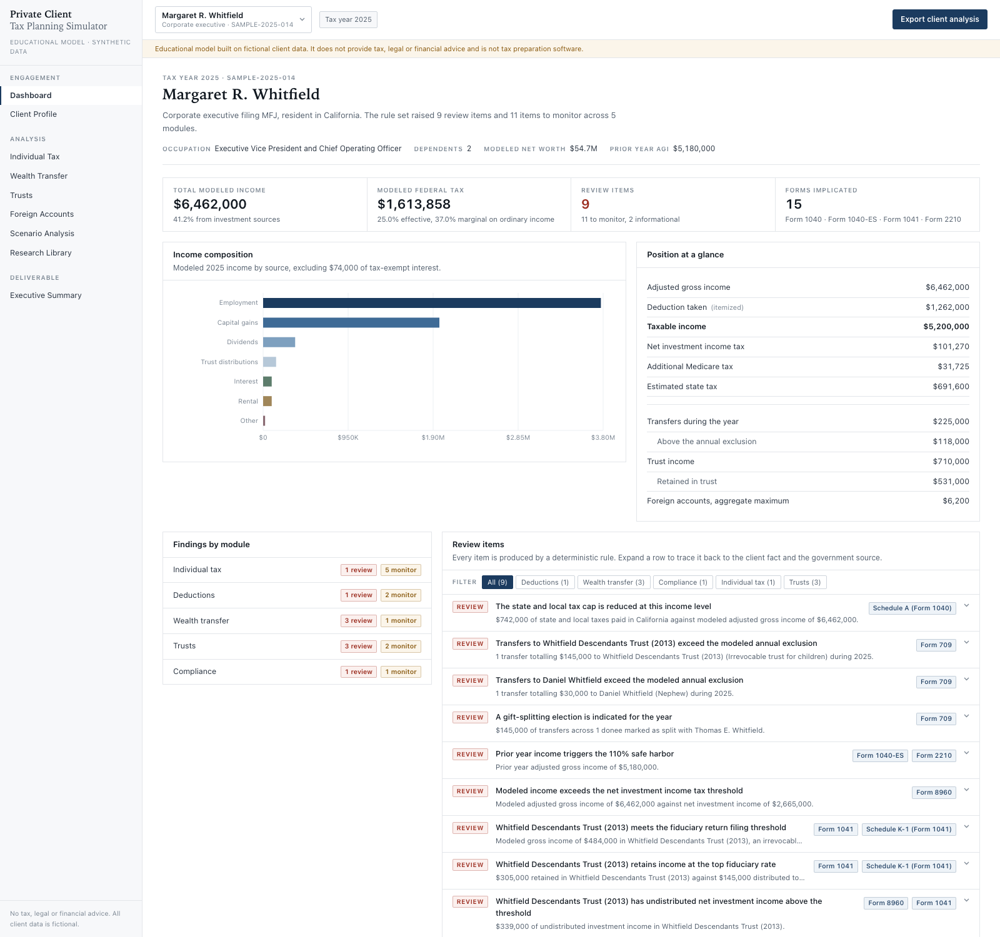

---

## Contents

- [The business problem](#the-business-problem)
- [What the application does](#what-the-application-does)
- [Architecture](#architecture)
- [Data model](#data-model)
- [Tax concepts explored](#tax-concepts-explored)
- [The rule engine](#the-rule-engine)
- [Government sources](#government-sources)
- [Screenshots](#screenshots)
- [Excel export](#excel-export)
- [Running it](#running-it)
- [Testing](#testing)
- [Synthetic data generation](#synthetic-data-generation)
- [Deployment](#deployment)
- [Limitations](#limitations)
- [Disclaimer](#disclaimer)

---

## The business problem

A private-client engagement starts long before a return is prepared. Somebody has
to read the client's facts, work out which regimes are in play, and produce a
short list of questions that need a human answer. The work is largely mechanical
— aggregate the year's gifts by donee, sum the maximum values of foreign
accounts, compare each total against a published threshold — but it is spread
across an organizer, a brokerage statement, a trustee's letter and a client's
recollection, and the thresholds change every year.

Three failure modes recur:

**The measurement is done on the wrong base.** The FBAR aggregate test is applied
account by account rather than to the aggregate, so four accounts of $4,000 each
are treated as below a $10,000 threshold. A gift to a trust with no withdrawal
right is netted against the annual exclusion, which does not reach future
interests.

**A conclusion travels without its source.** A working paper records "$19,000
exclusion" with no citation. The following year the figure is stale, and nothing
in the file says where it came from or when it was last checked.

**Reporting is confused with liability.** "You have to file a 709" gets heard as
"you owe gift tax." The two are different questions, and the distinction is the
part a client most needs explained.

This project addresses those three things directly. It does the aggregation on
the correct base, it refuses to state a conclusion that cannot point at a
government source, and it separates *a form may be required* from *tax may be
owed* in every place the question arises.

---

## What the application does

Eight modules, each keyed to a form or a regime:

| Module | Question it answers |
| --- | --- |
| **Dashboard** | What did the rule set raise on this client, and how large is the position? |
| **Client Profile** | What facts is the analysis running on? |
| **Individual Tax** | How does the modeled year compose, and where does it sit against the rate schedules? (Form 1040) |
| **Wealth Transfer** | How does each donee measure against the annual exclusion? (Form 709) |
| **Trusts** | How is trust income composed, and how much stays behind at the compressed rates? (Form 1041) |
| **Foreign Accounts** | Does the aggregate cross the FBAR and Form 8938 thresholds? (FinCEN Form 114, Form 8938) |
| **Scenario Analysis** | What changes if one planning lever moves? |
| **Research Library** | Which rule produced this flag, and what does the source actually say? |

Plus an **Executive Summary** deliverable and an **Excel export** for the client
file.

### Loading your own record

The three sample clients are the ones that ship with the project, but the engine
is not tied to them. `/load` takes a client record as JSON and runs all nine
modules on it.

That page reads and analyses the record **entirely in the browser**. Nothing is
uploaded, nothing is written to a server, and the record is discarded when the
tab closes — it is held in `sessionStorage`, not `localStorage`, so it cannot
outlive the sitting that created it. The Excel export works there too: ExcelJS is
imported on click rather than at page load, so the workbook is built locally
without adding half a megabyte to the page for everyone who never presses it.

Anything omitted from the record takes a sensible default, so a useful input is a
few lines rather than two hundred:

```json
{
  "displayName": "Test client",
  "filingStatus": "single",
  "income": { "wages": 900000 },
  "gifts": [{ "recipient": "A. Beneficiary", "amount": 44000 }],
  "foreignAccounts": [
    { "institution": "Bank A", "country": "France", "maximumValueUSD": 6000 },
    { "institution": "Bank B", "country": "Japan",  "maximumValueUSD": 5000 }
  ]
}
```

Amounts may be written as `44000`, `"44000"` or `"$44,000"`. Errors name the
field and say what was expected. Fields the model does not use are reported as
warnings rather than silently dropped, and identifying fields are never carried
through — a pasted `ssn` or `address` does not survive parsing, and a test
asserts it.

It is a portfolio demonstration rather than an approved system for handling
client data, and the page says so: use invented figures.

Three sample clients ship with the project, chosen so that each exercises a
different part of the rule set:

| Client | Archetype | Drives |
| --- | --- | --- |
| Margaret R. Whitfield | Corporate executive (CA) | Equity compensation, a concentrated position, appreciated-securities giving, a Crummey trust, foreign accounts *below* the FBAR threshold |
| Desmond A. Oyelaran | Business owner (TX) | Pass-through income and § 199A, a gift of closely held units in trust with no withdrawal right, generation-skipping transfers, a charitable remainder trust, *no* foreign accounts |
| Anders J. Lindqvist | International executive (Singapore) | Six foreign accounts across three countries, a foreign corporation, a PFIC, a foreign trust, a non-citizen spouse, an unresolved state domicile |

The negative cases matter as much as the positive ones. Whitfield's single
Canadian account and Oyelaran's empty foreign section demonstrate that the flags
are driven by the facts rather than by the archetype.

---

## Architecture

Next.js App Router, TypeScript throughout, Tailwind CSS v4, Recharts for the
charts, ExcelJS for the workbook. No database: client records are typed data in
the repository, and every page is statically prerendered per client.

```
src/
  app/
    clients/[clientId]/          one route per module, all statically generated
      dashboard/ profile/ individual-tax/ wealth-transfer/
      trusts/ foreign-accounts/ scenarios/ research/ summary/
    api/export/[clientId]/       ExcelJS workbook, Node runtime
  lib/
    types.ts                     the client record
    tax-year/
      types.ts                   the shape of a filing season
      2025.ts                    the 2025 amounts, each keyed to a source
      index.ts                   registry; getTaxYear() throws on an unmodeled year
    research/
      types.ts                   Authority: topic, year, rule, citation, URL, verified date
      authorities.ts             45 entries, government sources only
    rules/
      types.ts                   Finding, RuleContext, RuleDefinition
      individual.ts  deductions.ts  wealth-transfer.ts  trust.ts  foreign.ts
      index.ts                   evaluateClient(): runs all 39 rules, sorts, groups
    analysis/
      federal-model.ts           the simplified federal computation
      gifts.ts  trusts.ts  foreign.ts
      scenarios.ts               four columns from one client record
      executive-summary.ts       the deliverable
    excel/
      styles.ts                  formats, borders, conditional formatting helpers
      workbook.ts                the eight sheets
  components/
    shell/  ui/  charts/  findings/  research/  scenarios/
  data/
    clients/                     the three sample records
    synthetic/                   seeded generator for the test cohort
```

Three properties are load-bearing:

**Constants are data, not code.** Every threshold lives in
`src/lib/tax-year/2025.ts` and carries a `sourceKeys` entry pointing at the
research library. Adding 2026 is a new data file and a registry entry; no rule
changes. `getTaxYear()` throws for an unmodeled year rather than silently falling
back.

**Rules are pure functions.** A rule takes `{ client, constants, federal, gifts,
trusts, foreign }` and returns findings. It has no I/O, no randomness and no
model call. Running `evaluateClient` twice on the same record produces byte-identical
output, and a test asserts it.

**Analysis is separate from interpretation.** `analyzeGifts` does arithmetic —
group by donee, apply the exclusion, subtract. The rule modules decide what that
arithmetic means and attach the citation. The Excel export and the executive
summary consume the same two layers, so a figure cannot disagree between the
screen and the workbook.

Longer notes on the decisions behind those properties, and on a few modelling
choices that are not obvious from the code, are in
[`docs/architecture-notes.md`](docs/architecture-notes.md).

---

## Data model

The client record (`src/lib/types.ts`) is deliberately narrow. **There is no
field capable of holding a taxpayer identification number, date of birth, street
address or account number**, and a test asserts that none has been added.

```ts
interface Client {
  id, displayName, archetype, engagementRef, taxYear, age
  filingStatus: 'single' | 'marriedFilingJointly' | 'marriedFilingSeparately'
              | 'headOfHousehold' | 'qualifyingSurvivingSpouse'
  spouseName?, spouseIsUSCitizen           // drives § 2523(i) rather than the marital deduction
  residency: { stateCode, topMarginalStateRate, livesAbroad, countryOfResidence? }
  dependents: Dependent[]

  income:      IncomeProfile      // 15 lines grouped the way a 1040 organizer groups them
  deductions:  DeductionProfile   // charitable split by donee type and asset type
  balanceSheet: BalanceSheet      // concentrated positions carry basis and how they were acquired

  gifts:            Gift[]
  foreignAccounts:  ForeignAccount[]
  foreignEntities:  ForeignEntityInterest[]
  trusts:           TrustRecord[]

  priorYearAdjustedGrossIncome     // § 6654 safe harbor
  lifetimeExclusionPreviouslyUsed  // unified credit tracking
  advisorNotes: string[]
}
```

A few field choices carry most of the analytical weight:

`Gift` records `presentInterest`, `intoTrust` and `crummeyWithdrawalRight`
separately, because the annual exclusion turns on the character of the interest
rather than the amount. A $10,000 transfer into trust without a withdrawal right
is reportable; a $19,000 transfer with one is not.

`ForeignAccount` records `maximumValueUSD` and `yearEndValueUSD` separately.
FBAR tests the maximum during the year; Form 8938 tests both the year-end value
and the maximum, against different thresholds. `interestType` distinguishes
signature authority from ownership, because signature authority alone creates an
FBAR obligation but generally falls outside Form 8938 — which is why the module
tracks two aggregates.

`TrustRecord` records `capitalGainsAllocatedToIncome`. Gains allocated to
principal are ordinarily excluded from distributable net income, so they stay at
the fiduciary level and are taxed at the compressed rates even where the trust
distributes all of its accounting income.

---

## Tax concepts explored

**Individual income.** Rate schedules by filing status; the stacking of long-term
gain and qualified dividends above ordinary income to determine the applicable
rate band; the 3.8% net investment income tax on the lesser of net investment
income or income above the § 1411 threshold; the 0.9% additional Medicare tax and
why two-earner households find a balance due; flat supplemental withholding on
bonus and equity compensation against a 37% marginal rate; the § 6654 safe
harbor at 110% where prior-year income exceeded $150,000.

**Deductions.** The 2025 state and local tax cap and its phase-down above
$500,000 of modified adjusted gross income; the § 170(b) percentage limitations
by donee type and asset type, with the interaction between the 30% appreciated
property ceiling and the 60% overall ceiling; five-year carryforwards; Form 8283
substantiation and the publicly traded securities exception to the appraisal
requirement.

**Wealth transfer.** The annual exclusion applied per donee on aggregated
transfers; the present interest requirement and Crummey withdrawal powers;
§ 2513 gift splitting and the return each spouse must file; the § 2523(i)
exclusion for a non-citizen spouse in place of the unlimited marital deduction;
generation-skipping transfers and exemption allocation; carryover basis under
§ 1015 and the basis adjustment forgone; unified credit tracking against the
basic exclusion amount.

**Fiduciary.** The compressed rate schedule — a trust reaches 37% at $15,650
where a joint return reaches it at $751,600; the distribution deduction and the
allocation of capital gain between income and principal; the $600 gross income
filing threshold and the nonresident alien beneficiary trigger; the grantor trust
rules and where the income is actually reported; charitable remainder trusts on
Form 5227 rather than Form 1041, and the four-tier character ordering of their
distributions.

**International.** The FBAR aggregate test and why it is not applied account by
account; Form 8938 on a different base against different thresholds, including
the higher thresholds for a taxpayer living abroad; signature authority; PFICs
and the default § 1291 regime; Form 5471 filer categories; foreign trusts and
Forms 3520 / 3520-A; foreign pensions that are not qualified plans for U.S.
purposes; the foreign tax credit and treaty rates.

---

## The rule engine

39 rules across six modules:

| Module | Rules | Examples |
| --- | --- | --- |
| Individual tax | 8 | `IND-NIIT`, `IND-CG-TOP-RATE`, `IND-AMT-SCREEN`, `IND-QBI-THRESHOLD` |
| Deductions | 6 | `DED-SALT-PHASEDOWN`, `DED-CHARITABLE-LIMIT`, `DED-GIFT-BASIS` |
| Wealth transfer | 7 | `GIFT-ANNUAL-EXCLUSION`, `GIFT-FUTURE-INTEREST`, `GIFT-GST-SKIP-PERSON` |
| Trusts | 8 | `TRUST-COMPRESSED-BRACKETS`, `TRUST-NIIT`, `TRUST-CRT-5227` |
| Foreign accounts | 8 | `FBAR-AGGREGATE`, `FATCA-8938`, `FOREIGN-PFIC`, `FOREIGN-5471` |
| Compliance | 2 | `IND-ESTIMATED-TAX`, `IND-SUPPLEMENTAL-WITHHOLDING` |

Each rule declares the predicate it evaluates, in words, alongside the code:

```ts
{
  id: 'FBAR-AGGREGATE',
  name: 'FBAR aggregate account threshold',
  module: 'foreign',
  description:
    'Sums the maximum calendar-year value of every recorded foreign financial ' +
    'account, including accounts held only under signature authority, and ' +
    'compares the total with the $10,000 aggregate threshold.',
  test: 'sum of maximum account values > $10,000',
  authorityIds: ['fincen-114-threshold', 'irs-fbar-overview'],
  evaluate: ({ foreign }) => { /* ... */ },
}
```

**No generative model determines whether a filing requirement exists.** The
predicate is arithmetic on the client record; the citation is a fixed key into
the research library; the analysis text is composed from values the arithmetic
already produced. The rule set is enumerated in the Research Library at runtime,
including which rules did *not* fire for the client on screen — an absent flag is
as much a result as a present one.

Every finding carries the full chain, and the UI renders it as five numbered
steps:

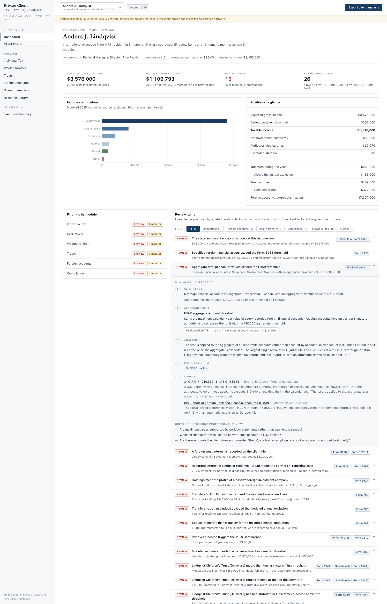

Findings are addressable. Expanding one rewrites the location hash, so
`…/dashboard#finding-FBAR-AGGREGATE` links a colleague straight to the item.

Severity is three-valued and the wording is chosen carefully:

- **Review indicated** — a filing position that needs a professional's judgement
- **Monitor** — a threshold crossed that does not on its own imply a separate filing
- **Note** — context

Nothing in the application says a form *is* required, or that tax *is* owed.

---

## Government sources

45 authorities, all from primary or agency sources — `irs.gov`,
`uscode.house.gov`, `ecfr.gov` and `govinfo.gov`. A test asserts that no entry
cites any other host and that every URL is https.

Each entry carries the six fields the project requires of any tax statement:

```ts
{
  id: 'rp-2024-40-annual-gift-exclusion',
  topic: 'Annual exclusion for gifts',
  taxYear: 2025,
  ruleDescription:
    'For calendar year 2025 the first $19,000 of gifts of present interests to ' +
    'any one donee is excluded from taxable gifts. The exclusion for gifts to a ' +
    'spouse who is not a U.S. citizen is $190,000.',
  citation: 'Rev. Proc. 2024-40, § 2.43; IRC §§ 2503(b), 2523(i)',
  governmentSource: 'Internal Revenue Service',
  sourceUrl: 'https://www.irs.gov/pub/irs-drop/rp-24-40.pdf',
  lastVerified: '2026-08-24',
  category: 'wealthTransfer',
  kind: 'revenueProcedure',
  relatedForms: ['Form 709'],
}
```

The principal sources behind the 2025 constants:

| Amount | Source |
| --- | --- |
| Rate schedules, capital gain breakpoints, AMT, § 199A, fiduciary rates, annual gift exclusion, basic exclusion amount | [Rev. Proc. 2024-40](https://www.irs.gov/pub/irs-drop/rp-24-40.pdf) |
| Standard deduction and state and local tax cap as amended for 2025 | [P.L. 119-21](https://www.govinfo.gov/content/pkg/PLAW-119publ21/pdf/PLAW-119publ21.pdf) |
| Net investment income tax thresholds | [IRC § 1411](https://uscode.house.gov/view.xhtml?req=granuleid:USC-prelim-title26-section1411&num=0&edition=prelim) |
| FBAR aggregate threshold | [31 C.F.R. § 1010.350](https://www.ecfr.gov/current/title-31/section-1010.350) |
| Form 8938 thresholds | [Instructions for Form 8938](https://www.irs.gov/instructions/i8938) |
| Form 1041 filing threshold | [Instructions for Form 1041](https://www.irs.gov/instructions/i1041) |
| Form 709 filing requirement | [Instructions for Form 709](https://www.irs.gov/instructions/i709) |

Two of those deserve a note. The 2025 standard deduction and state and local tax
cap were changed by legislation *after* Rev. Proc. 2024-40 was published, so the
revenue procedure alone is stale for those two lines — which is exactly why the
constants file records a source key per figure rather than one citation for the
file. And the § 1411 thresholds are statutory and carry no annual inflation
adjustment, so they are cited to the Code rather than to the revenue procedure.

`lastVerified` records the date the URL resolved and the quoted figures were
re-read against the source. **Re-check before relying on any entry for live
work.**

---

## Screenshots

### Client profile — the facts the analysis runs on
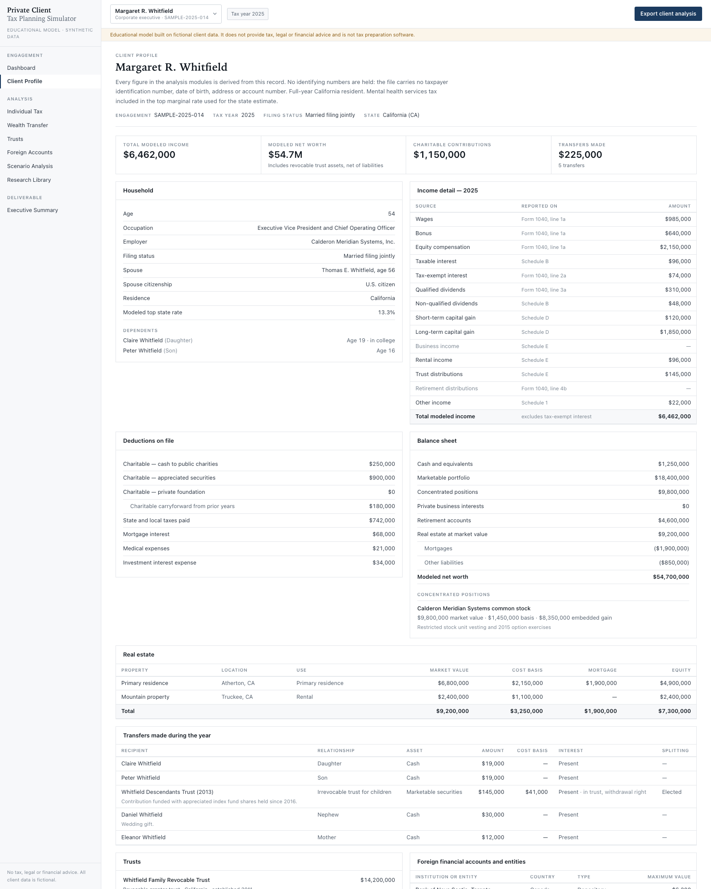

### Individual tax — composition, rate bands and deduction limits
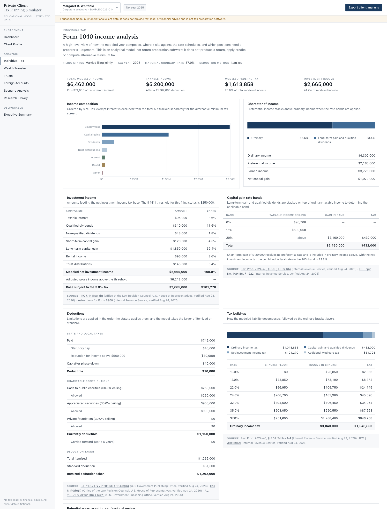

### Wealth transfer — each donee against the annual exclusion
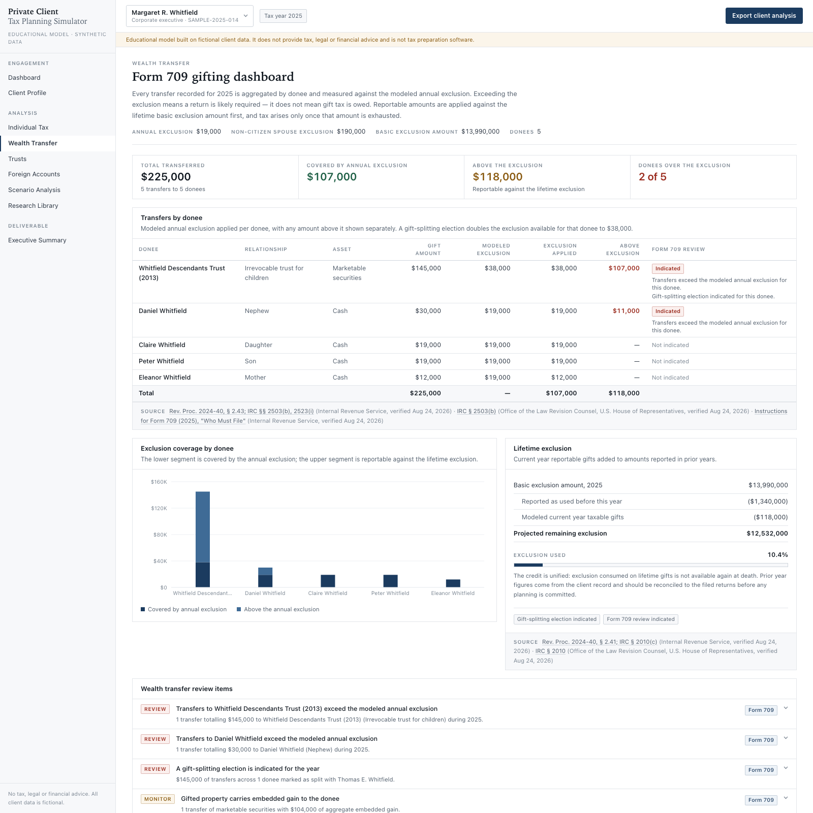

### Trusts — composition, distributions and what stays behind
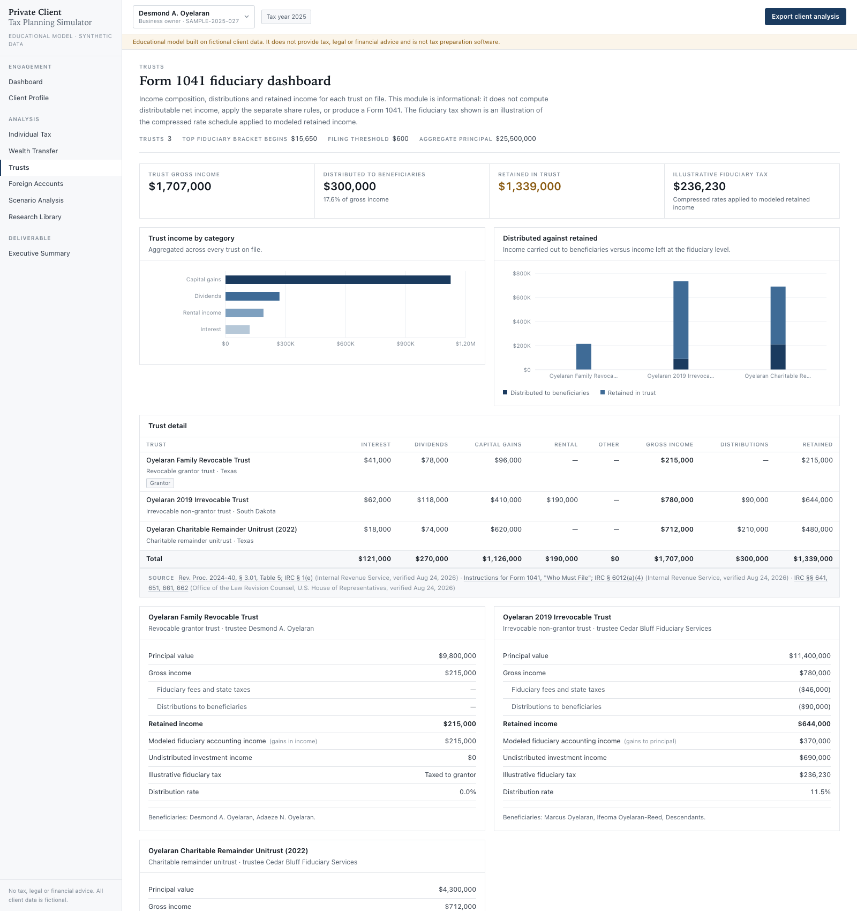

### Foreign accounts — the aggregate tests, applied mechanically
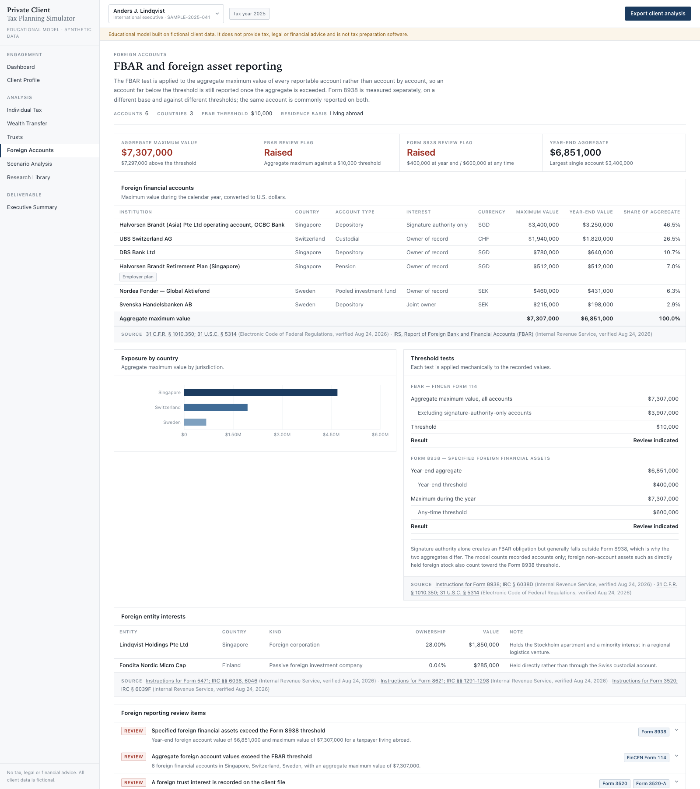

### Scenario analysis — four columns, one lever each
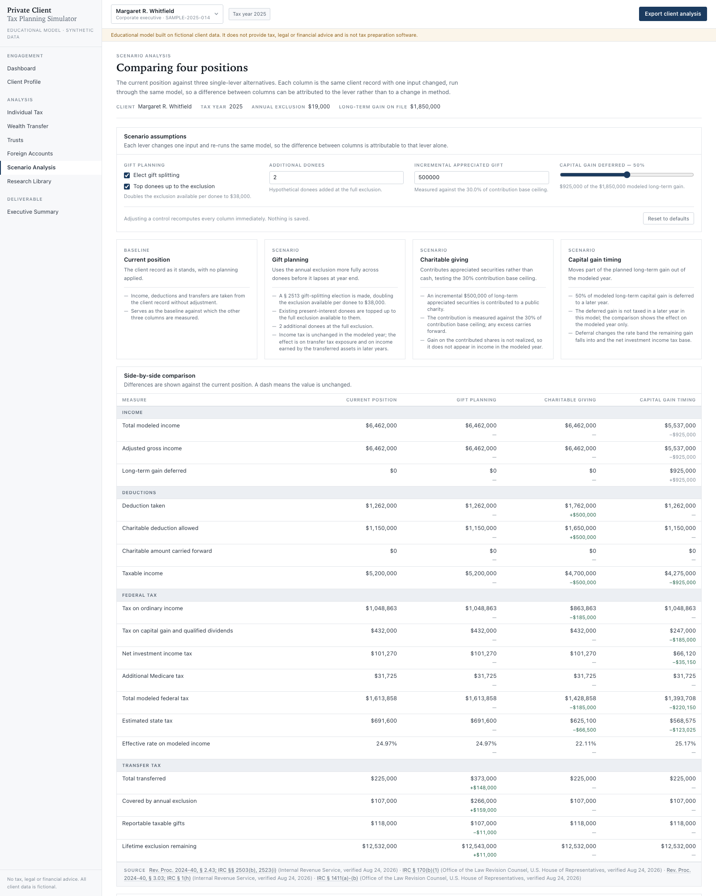

### Research library — the rule set and its sources
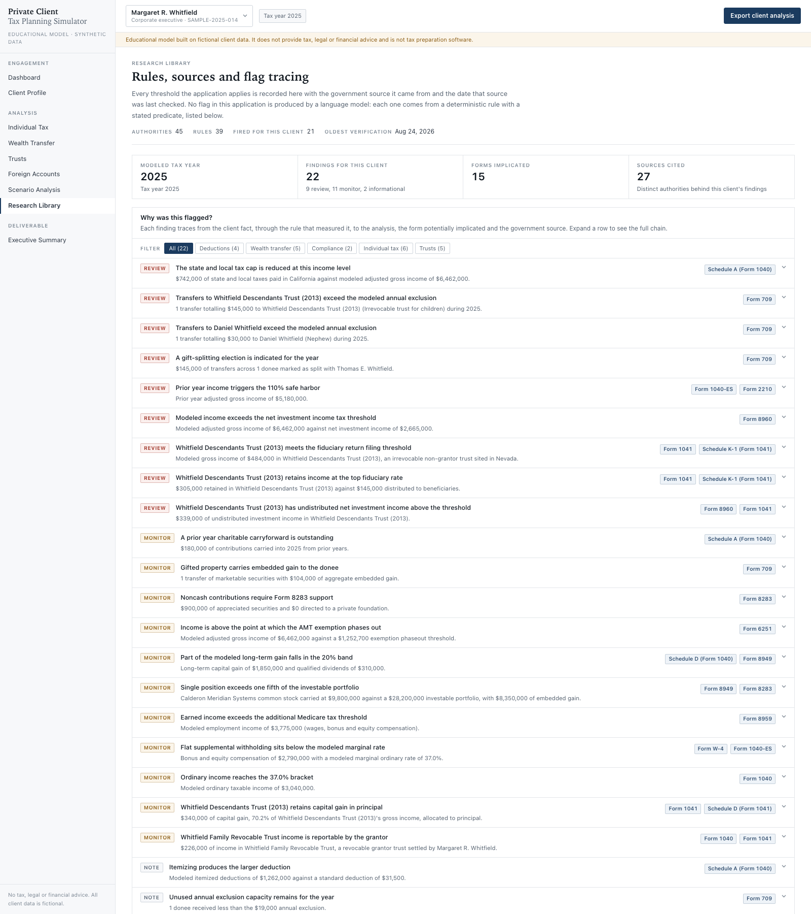

### Executive summary — the client deliverable
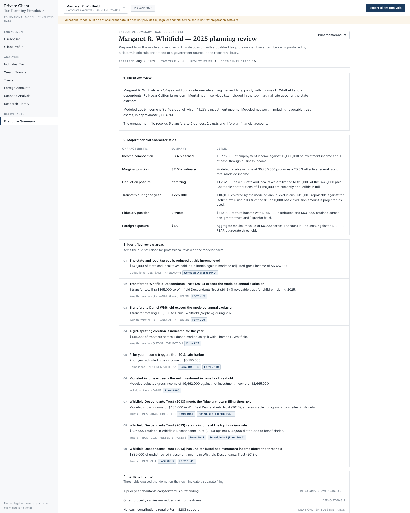

### Loading your own record — read and analysed in the browser
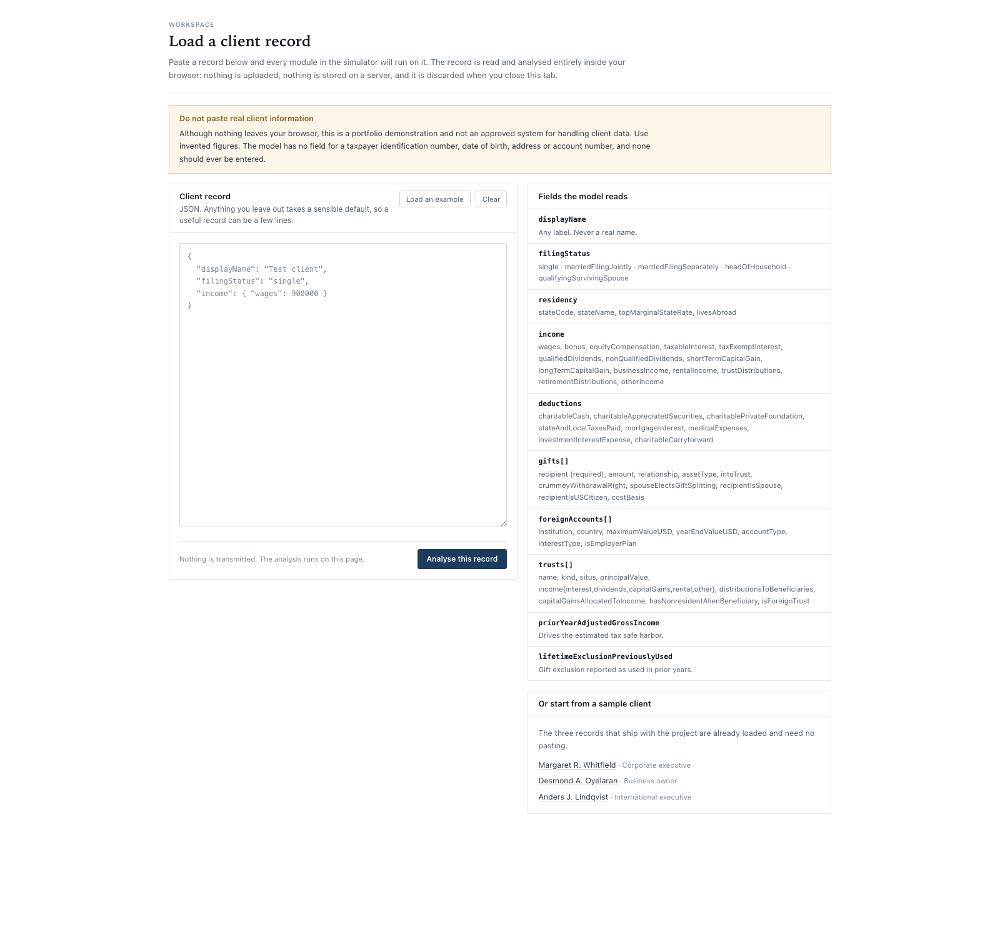

Screenshots are regenerated from a production build with
`scripts/capture-screenshots.sh`.

---

## Excel export

`Export client analysis` builds a workbook through ExcelJS in a Node route
handler. Eight sheets, ordered so the tabs read in sequence:

| Sheet | Contents |
| --- | --- |
| `01_Client_Profile` | Household, balance sheet with data bars, engagement notes, data-protection statement |
| `02_Income_1040` | Income by source with 1040 line references, deduction limitations, tax build-up |
| `03_Gift_709` | Donee summary with conditional formatting on the excess column, then transfer-level detail |
| `04_Trust_1041` | Income by category, distributions and retained income, fiduciary attributes |
| `05_Foreign_Accounts` | Accounts, country exposure, threshold tests, foreign entity interests |
| `06_Scenario_Analysis` | Premises, parameters, and the side-by-side grid with delta columns on a colour scale |
| `07_Tax_Research` | Modeled constants, the full rule set with fired/not-triggered status, the source library with live hyperlinks |
| `08_Executive_Summary` | The deliverable, with every finding and every open question |

Formatting is applied consistently rather than per sheet: a navy title block with
the standing disclaimer frozen at the top of every sheet, accounting number
formats that render zero as an em dash, hairline borders, banded rows, bold
totals with a rule above, percentage formats on share columns, data bars on
magnitude columns, and conditional formatting that picks out amounts above a
threshold and cells reading "Raised", "Indicated" or "Fired". Each analysis sheet
closes with an assumptions and limitations block, and sheet 07 carries the source
documentation for the whole workbook.

---

## Running it

Requires Node 20 or later.

```bash
npm install
npm run dev
```

Then open <http://localhost:3000>. The root redirects to the first sample client.

| Script | Purpose |
| --- | --- |
| `npm run dev` | Development server |
| `npm run build` | Production build; type-checks the whole repository including tests |
| `npm start` | Serve the production build |
| `npm test` | Vitest suite |
| `npm run typecheck` | `tsc --noEmit` |
| `npm run lint` | ESLint |
| `npm run generate:clients` | Generate the synthetic cohort and a rule-coverage report |

---

## Testing

152 tests across nine files, run with `npm test`.

| File | Covers |
| --- | --- |
| `gift-rules.test.ts` | Amounts below, exactly at and above the annual exclusion; aggregation of several transfers to one donee; multiple recipients; gift splitting; present versus future interests; citizen and non-citizen spouses; lifetime exclusion tracking |
| `foreign-rules.test.ts` | Aggregates below, exactly at and above the FBAR threshold; multiple accounts each individually below it; signature authority tracked separately; Form 8938 by filing status and residence, including the any-time test passing where the year-end test does not; § 5471, PFIC and foreign pension rules |
| `trust-rules.test.ts` | Clients with and without trusts; the $600 filing threshold at the boundary; grantor trusts excluded; charitable remainder trusts routed to Form 5227; retained income and the compressed schedule; capital gain allocation; nonresident alien beneficiaries; multiple trusts and the distribution tie-out |
| `federal-model.test.ts` | Bracket arithmetic checked against the cumulative amounts published in Rev. Proc. 2024-40; capital gain stacking; the SALT phase-down and its floor; charitable ceiling interaction; net investment income tax on both limbs of the "lesser of" |
| `client-input.test.ts` | Parsing a pasted record: the minimal case, money written with dollar signs and commas, defaults for omitted fields, malformed JSON explained in plain terms, a bad filing status, an unmodeled tax year, a gift missing a recipient, and confirmation that identifying fields never survive parsing |
| `research-integrity.test.ts` | Unique ids; government hosts only; https; ISO verification dates; every rule cites at least one authority that exists; every finding carries a full chain; findings ordered by severity; evaluation is deterministic; no identifying-number fields |
| `scenarios.test.ts` | Column order and baseline; assumptions present; the client record is not mutated; each lever moves the metrics it should and leaves the rest alone |
| `synthetic-cohort.test.ts` | Seed determinism; cohort spans both sides of every threshold; **all 39 rules fire at least once across 100 generated clients**; no non-finite figures; tax never exceeds modeled income |
| `excel-export.test.ts` | Eight sheets in order; disclaimer and client name on every sheet; frozen panes; conditional formatting present; currency and percentage formats applied; source hyperlinks; assumptions blocks; a client with no trusts, gifts or foreign accounts still exports |

The boundary tests are the point. `FBAR_THRESHOLD` exactly is not flagged;
`FBAR_THRESHOLD + 1` is — the regulation asks whether the aggregate *exceeds*
$10,000, not whether it reaches it.

---

## Synthetic data generation

```bash
npm run generate:clients                          # 100 records, default seed
npm run generate:clients -- --count 500 --seed 7  # a different cohort
```

Writes `data-generated/synthetic-clients-2025.json` and a per-client summary CSV,
then prints how many times each rule fired:

```
Rule coverage across the cohort:
  GIFT-ANNUAL-EXCLUSION            142
  TRUST-CAPITAL-GAIN-ALLOCATION    127
  IND-NIIT                         100
  ...
  GIFT-NONCITIZEN-SPOUSE             5

Every rule fired at least once.
```

The generator (`src/data/synthetic/generator.ts`) is seeded, so a seed always
reproduces the same cohort and a failing case is reproducible. Distributions are
chosen to straddle the thresholds deliberately — roughly a third of donees sit at
or below the annual exclusion, 30% of records have no foreign accounts and
another 15% sit below the aggregate threshold — so the cohort exercises the
negative branch of each rule rather than only the positive one. Names are built
from invented syllable pools and cannot collide with a real person.

---

## Deployment

Deploys to Vercel with no configuration. Every page is statically prerendered per
client at build time; the only server work is the Excel route, which runs on the
Node runtime (`exceljs` is listed in `serverExternalPackages`). No database, no
environment variables, no secrets.

```bash
npx vercel
```

---

## Limitations

The federal model is deliberately simplified, and the application says so on
screen wherever a figure is shown. It does **not**:

- compute alternative minimum tax — it screens for the fact pattern and asks for Form 6251
- compute the § 199A deduction — the wage and qualified property limitations need entity-level figures the record does not carry
- apply passive activity loss, at-risk or excess business loss limitations
- calculate credits, including the foreign tax credit
- calculate self-employment tax
- prepare a state return; state tax is a single top marginal rate applied to taxable income
- apply the five-year ordering rules to charitable carryforwards
- compute distributable net income, apply the separate share rules, or model the § 663(b) sixty-five day election

Further scope boundaries worth stating plainly:

- **One tax year is modeled.** 2025. The registry is built for more, and adding a year is a data file, but only 2025 exists today.
- **Scenario differences are modeled-year effects.** The capital gain timing column defers gain rather than eliminating it, and the deferred amount is not taxed in a later year, so that column overstates the benefit of deferral considered on its own. The gift planning column has no income tax effect in the modeled year at all; its value is in later years and at death.
- **An absent flag is not an assurance.** The rules measure what is in the record. Whitfield's foreign section shows no FBAR flag because the one recorded account is $6,200 — not because a search was performed.
- **Valuation is taken as given.** Closely held interests and appreciated property are carried at the value on the record. Discounts, appraisals and the substance of a transfer are outside the model.
- **No multi-user state, authentication or persistence.** Client records are code.

---

## Disclaimer

**This application does not provide tax, legal or financial advice.** It is an
educational analytical tool built as a portfolio project. It is not tax
preparation software, it does not produce a tax return, and its output is not a
covered opinion and cannot be relied on to avoid penalties.

**All client data is fictional.** Every name, employer, financial institution,
trust, address and amount is invented. Any resemblance to a real person or entity
is coincidental. The data model has no field capable of holding a taxpayer
identification number, date of birth, street address or account number, and no
real personal information should ever be entered into it.

**Tax figures change.** The amounts modeled here are the published 2025 figures
as verified on the dates recorded in the research library. Amounts are adjusted
annually and legislation can supersede a published figure mid-year, as it did for
the 2025 standard deduction and state and local tax cap. Verify every figure
against its source before relying on it.

**Consult a qualified professional.** Any real tax, estate or financial planning
decision should be made with a licensed CPA, tax attorney or financial adviser
who has reviewed the actual facts.
